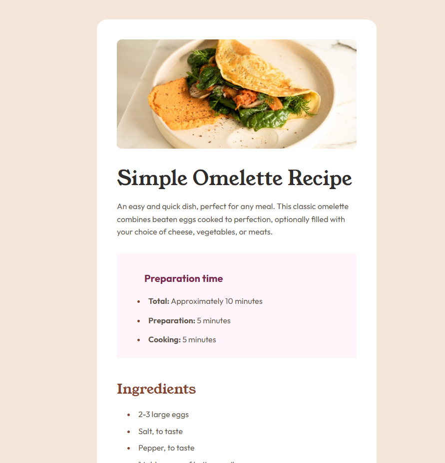

# Front-end Projects


## 📑 Table of Contents
* [Overview](#overview)
* [Repo Structure](#-repo-structure)
* [How to Run](#️how-to-run)
* [Projects](#-projects)
    * [The Odin Project](#-the-odin-project)
    * [Frontend Mentor](#-frontend-mentor-challenges)
* [Tech Stack](#️-tech-stack)
* [Resources](#-resources)


## Overview

This repository serves as a central hub for my frontend projects. It features solutions from **The Odin Project** curriculum and challenges from the **Frontend Mentor** platform.
Projects focus on semantic HTML, advanced CSS (Flexbox/Grid), interactive JavaScript and high-precision design implementation.

📊 **Project Insights**


| Metric | Status |
| :--- | :--- |
|**Total Challenges** | 8 (4 The Odin Project + 4 Frontend Mentor) |
| **Status** | Completed & Deployed |
| **Responsiveness** | Desktop-first |
| **Performance** | Optimized for Lighthouse |
| **Timeline** | March – Oct 2025 📅|


## 📂 Repo Structure

```text
📂 frontend-projects/
├── 📂 assets/                  
├── 📂 the-odin-project/       
│   ├── 01-recipes/
│   ├── 02-landing-page/
│   ├── 03-rock-paper-scissors/
│   └── 04-etch-a-sketch/
└── 📂 frontend-mentor/         
    ├── 01-qr-code-component/
    ├── 02-blog-preview-card/
    ├── 03-recipe-page/
    └── 04-social-links-profile/
   
```

## ⚙️How to Run

1. **Clone the repository**
   ```bash
   git clone https://github.com/dinruz/frontend-projects.git
   ```
2. **Navigate to any project folder**

    For example:

    ```bash 
    cd the-odin-project/01-recipes
    ```
3.   **Open `index.html` in your browser** 🌐 or **use *Live Server* ⚡ in VS Code**

## 🧩 Projects

## The Odin Project

| # | Project | Preview | Description | Core Skills | Links |
| :--- | :--- | :--- | :--- | :--- | :--- |
| 01 | **Odin Recipes** |  | Multi-page recipe site | Semantic HTML | [Repo](https://github.com/dinruz/frontend-projects/tree/main/the-odin-project/01-recipes) / [Live](https://dinruz.github.io/frontend-projects/the-odin-project/01-recipes/) |
| 02 | **Landing Page** |  | Responsive marketing page | Flexbox & Layouts | [Repo](https://github.com/dinruz/frontend-projects/tree/main/the-odin-project/02-landing-page) / [Live](https://dinruz.github.io/frontend-projects/the-odin-project/02-landing-page/) |
| 03 | **Rock Paper Scissors** |  | Interactive logic game | JS & UI Updates | [Repo](https://github.com/dinruz/frontend-projects/tree/main/the-odin-project/03-rock-paper-scissors) / [Live](https://dinruz.github.io/frontend-projects/the-odin-project/03-rock-paper-scissors/) |
| 04 | **Etch-a-Sketch** |  | Dynamic drawing board | DOM Manipulation | [Repo](https://github.com/dinruz/frontend-projects/tree/main/the-odin-project/04-etch-a-sketch) / [Live](https://dinruz.github.io/frontend-projects/the-odin-project/04-etch-a-sketch/) |

---

## Frontend Mentor Challenges

| # | Project | Preview | Description | Core Skills | Links |
| :--- | :--- | :--- | :--- | :--- | :--- |
| 01 | **QR Code Component** |  | Simple QR card | HTML/CSS Basics | [Repo](https://github.com/dinruz/frontend-projects/tree/main/frontend-mentor/01-qr-code-component) / [Live](https://dinruz.github.io/frontend-projects/frontend-mentor/01-qr-code-component/) |
| 02 | **Blog Preview Card** |  | Card with hover states | Typography & Layout | [Repo](https://github.com/dinruz/frontend-projects/tree/main/frontend-mentor/02-blog-preview-card) / [Live](https://dinruz.github.io/frontend-projects/frontend-mentor/02-blog-preview-card/) |
| 03 | **Recipe Page** |  | Content organization | CSS Lists & Styling | [Repo](https://github.com/dinruz/frontend-projects/tree/main/frontend-mentor/03-recipe-page) / [Live](https://dinruz.github.io/frontend-projects/frontend-mentor/03-recipe-page/) |
| 04 | **Social Links Profile** |  | Personal profile links | Flexbox Centering | [Repo](https://github.com/dinruz/frontend-projects/tree/main/frontend-mentor/04-social-links-profile) / [Live](https://dinruz.github.io/frontend-projects/frontend-mentor/04-social-links-profile/) |


## 🛠️ Tech Stack 


## 📚 Resources

📎  [The Odin Project Foundations Course](https://www.theodinproject.com/paths/foundations/courses/foundations):

* [Project Recipes Instructions](https://www.theodinproject.com/lessons/foundations-recipes)
* [Project Landing Page Instructions](https://www.theodinproject.com/lessons/foundations-landing-page)
* [Project Rock Paper Scissors Instructions](https://www.theodinproject.com/lessons/foundations-rock-paper-scissors)
* [Project Etch-a-Sketch Instructions](https://www.theodinproject.com/lessons/foundations-etch-a-sketch)

📎 [Front-end Mentor](https://www.frontendmentor.io/home):

* [QR Code Component Challenge Instructions](https://www.frontendmentor.io/challenges/qr-code-component-iux_sIO_H)
* [Blog Preview Card Challenge Instructions](https://www.frontendmentor.io/challenges/blog-preview-card-ckPaj01IcS)
* [Recipe Page Challenge Instructions](https://www.frontendmentor.io/challenges/recipe-page-KiTsR8QQKm)
* [Social Links Profile Challenge Instructions](https://www.frontendmentor.io/challenges/social-links-profile-UG32l9m6dQ)

--

[⬆️ Back to Top](#front-end-projects)


