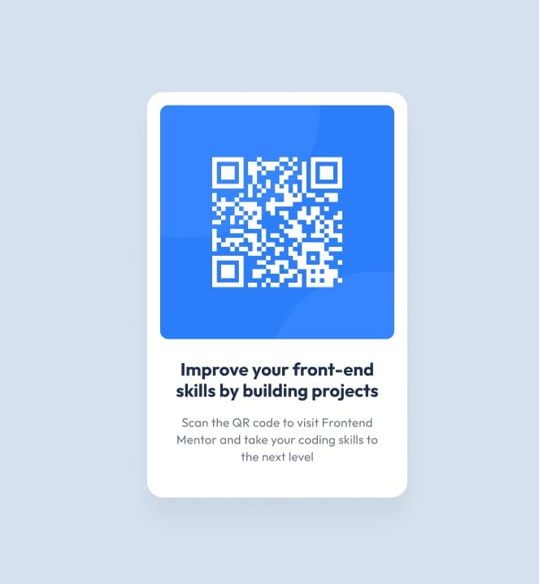
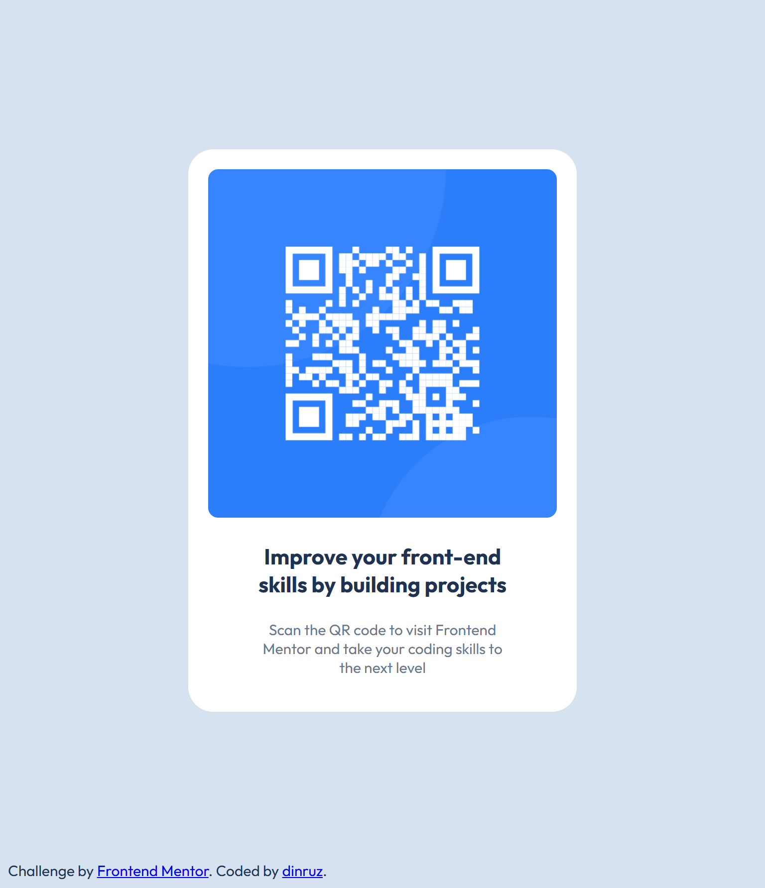

# Frontend Mentor: QR Code Component Solution

## Table of contents
- [Overview](#overview)
  - [Screenshot](#screenshot)
  - [Links](#links)
- [My process](#my-process)
  - [Built with](#built-with)
  - [What I learned](#what-i-learned)
  - [Useful resources](#useful-resources)

## Overview

This repo contains solution to the [QR code component challenge on Frontend Mentor](https://www.frontendmentor.io/challenges/qr-code-component-iux_sIO_H), based on given instructions, Figma design and the provided preview photos.

🎯 **Main Goal:** 

* Focus on writing semantic HTML and using the correct elements based on the content
* Train your eye for detail by getting your solution to look similar to the design

## Screenshot

<table>
  <tr> 
    <td align="center"><h4>Desired outcome</h4></td>
    <td align="center"><h4>Screenshot</h4></td>
  </tr>
  <tr>
    <td align="center">  </td>
    <td align="center">  </td>
  </tr> 
</table>

## Links

* [GitHub Repo](https://github.com/dinruz/frontend-projects/frontend-mentor/01-qr-code-component)
* [Watch demo](https://dinruz.github.io/frontend-projects/frontend-mentor/01-qr-code-component)

## My process

### Built with

### What I learned

* **Image and Paragraph Alignment/Spacing Issue:** 
  * The initial visual misalignment between the image and the text blocks due to the different widths of these blocks, even though I was trying to center them with Flexbox.
  * Understanding that align-items: center; centers the blocks as a whole, not their internal content if the blocks have different widths, was key.
 
* **Setting *width: 100%;*** on the image helped to fill all available space within the card (after padding), which significantly improved visual alignment with the text.

## Useful resources

- [QR code component challenge on Frontend Mentor](https://www.frontendmentor.io/challenges/qr-code-component-iux_sIO_H)

- [Josh W. Comeau: Interactive Guide To Flexbox](https://www.joshwcomeau.com/css/interactive-guide-to-flexbox/)