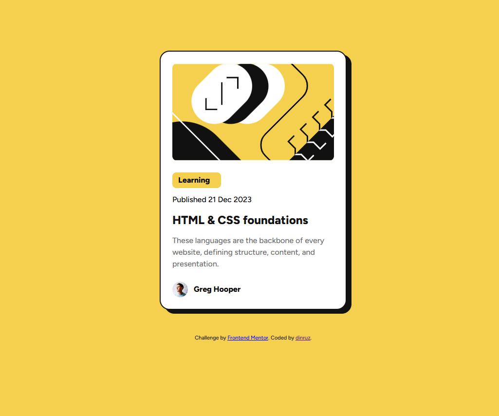

# Frontend Mentor: Blog preview card solution

## Table of contents

- [Overview](#overview)
- [Screenshot](#screenshot)
- [Links](#links)
- [My process](#my-process)
  - [Built with](#built-with)
  - [What I learned](#what-i-learned)
- [Useful resources](#useful-resources)

## Overview

This is a solution to the [Blog preview card challenge on Frontend Mentor](https://www.frontendmentor.io/challenges/blog-preview-card-ckPaj01IcS), based on given instructions, Figma design and the provided preview photos.

🎯 **Goal:** Users should be able to see hover and focus states for all interactive elements on the page.

🗓️ Jun 2025

## Screenshot

<table>
  <tr> 
    <td align="center"><h4>Desired Outcome</h4></td>
    <td align="center"><h4>Screenshot</h4></td>
  </tr>
  <tr>
    <td align="center">  </td>
    <td align="center">  </td>
  </tr> 
</table>

## Links

* [GitHub Repo](https://github.com/dinruz/frontend-projects/frontend-mentor/02-blog-preview-card)
* [Watch demo](https://dinruz.github.io/frontend-projects/frontend-mentor/02-blog-card-preview)

## My process

### Built with

### What I learned

* **using *flex: 1* on a parent container (like .main)** when the flex-direction is column can cause child elements to stretch vertically, leading to unintended layout issues. Removing *flex: 1* allowed the child element (.card) to take its natural height based on content.

* I realized a common syntax mistake when importing multiple font weights from Google Fonts; the correct separator is a semicolon (**;**) rather than a comma (,) (e.g.,*500;800*)."

## Useful resources

* [Blog preview card challenge on Frontend Mentor](https://www.frontendmentor.io/challenges/blog-preview-card-ckPaj01IcS)