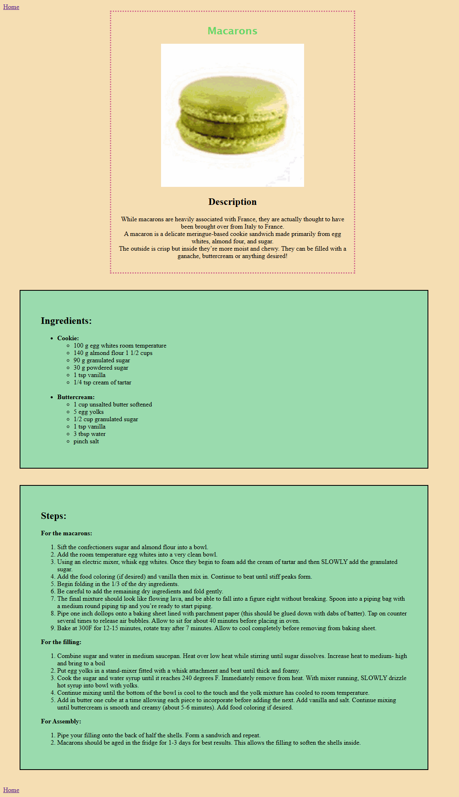
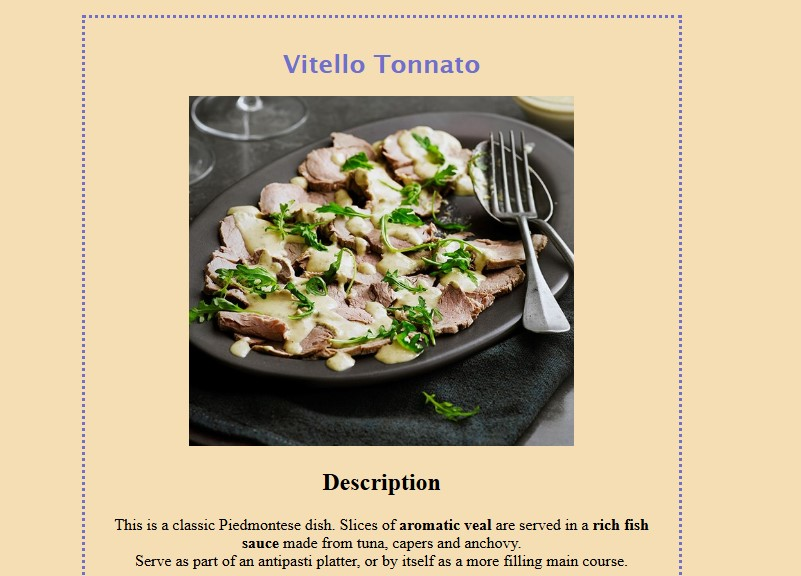

# The Odin Project: Recipes page

## Table of contents

- [Overview](#overview)
- [Links](#links)
- [Screenshots](#screenshots)
- [Tech Stack](#tech-stack)
- [Credits](#credits)

## Overview

This repository contains the solution for "Recipes", first project from The Odin Project curriculum, for practising HTML and CSS basics. 

📅 March 2025

**Goals:**

* mastering HTML boilerplate, basic CSS and document structure
* implementing Internal Linking using relative paths between directories
* working with Media and Lists to present structured content
* learning the basics of Publishing via GitHub Pages

## Links 

* Solution URL: [GitHub Repo](https://github.com/dinruz/frontend-projects/the-odin-project/01-recipes)
* Live Site URL: [Demo](https://dinruz.github.io/frontend-projects/the-odin-project/01-recipes)

## Screenshots

<table>
  <tr> 
    <td align="center"><h4>Full Page</h4></td>
    <td align="center"><h4>Detail</h4></td>
  </tr>
  <tr>
    <td align="center">  </td>
    <td align="center">  </td>
  </tr> 
</table>

## Tech Stack

##  Credits

🔗 Instructions: [**The Odin Project**](https://www.theodinproject.com/lessons/foundations-recipes) 
