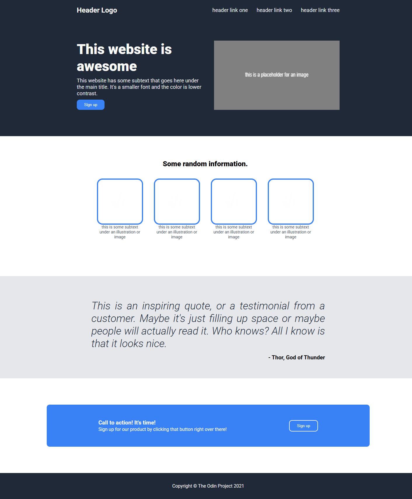

# The Odin Project: Landing Page Project

## Table of contents

- [Overview](#overview)
- [Links](#links)
- [Screenshot](#screenshot)
- [Tech Stack](#tech-stack)
- [Credits](#credits)

## Overview

This repository contains the solution for the "Landing Page" exercise assigned by The Odin Project Foundations course curriculum. This project aims to demonstrate fundamental HTML and CSS skills by replicating a given design of landing page with 5 main sections.

📅 May 2025

## Links 

* Solution URL: [GitHub Repo](https://github.com/dinruz/frontend-projects/the-odin-project/02-landing-page)
* Live Site URL: [Demo](https://dinruz.github.io/frontend-projects/the-odin-project/02-landing-page)

## Screenshot

<table>
  <tr> 
    <td align="center"><h4>Desired outcome</h4></td>
    <td align="center"><h4>Screenshot - achieved</h4></td>
  </tr>
  <tr>
     <td align="center">  </td>
    <td align="center">  </td>
 
  </tr> 
</table>

## Tech Stack

## Credits

🔗 The original instructions for this project can be found on [The Odin Project](https://www.theodinproject.com/lessons/foundations-landing-page).

🔗 Placeholder downloaded from: [Placeholderimage.dev](https://placeholderimage.dev/)