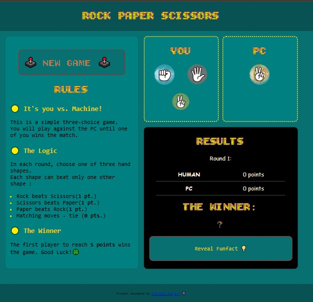
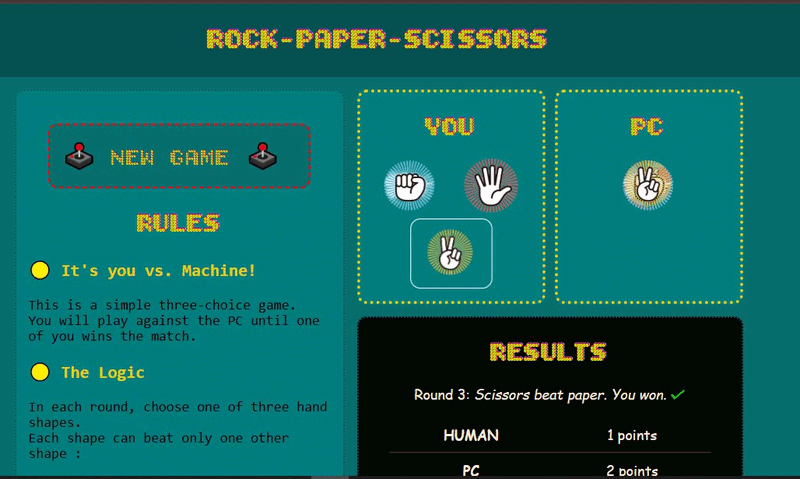
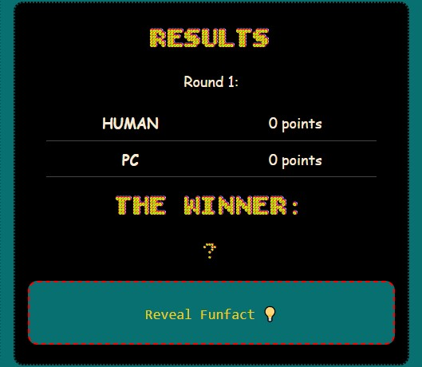
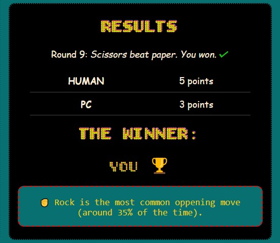

# The Odin Project: 'Rock Paper Scissors' Game

## Table of contents

- [Overview](#overview)
  - [Phase 1 - Console Logic](#phase-1-console-logic)
  - [Phase 2 - UI Implementation](#phase-2-ui-implementation)
- [Links](#links)
- [Screenshots](#screenshots)
- [Technical Details](#technical-details)
  - [Built with](#built-with)
  - [How to Play](#how-to-play)
- [Credits](#credits)

## Overview

This repository contains the solution for "Rock-Paper-Scissors" game project assigned by The Odin Project, as part of Foundations Course curriculum for practising JavaScript skills.
It's developed in two phases, demonstrating a progression from fundamental logic to advanced DOM manipulation.

 **Development Timeline**

Phase | Milestone | Core Skill | 📅  | Status |
:---  | :--- | :--- | :--- | :--- |
1 | **Console Logic** | Game logic & flow - if/else, Loops| June 2025 | ✅ Completed |
2 |  **UI Implementation** | Event listeners, DOM manipulation| Sept 2025 | ✅ Completed & Deployed |

### Phase 1: Console Logic 

* Implemented core **game logic** (win/loss conditions).
* Used **`if/else`** statements and **`for` loop** to control the game flow.

### Phase 2: UI Implementation

* **DOM Manipulation:** Dynamically updating scores, messages and PC choices; counting rounds.
* **Event Handling:** 

  - Implemented **click Event Listeners** to handle player input (replacing the use of `prompt()` from first phase).
  - Implemented 'New Game' functionality to fully **reset the game state**.  
  - Implemented 'Random Funfact', trivia about the game, using `Math.random()` to select from a predefined array.

 ⚠️  *This project is designed for standard desktop viewport resolutions and is **not fully responsive** for mobile devices.*

## Links

* Solution URL: [GitHub Repo](https://github.com/dinruz/frontend-projects/the-odin-project-04-rock-paper-scissors)
* Live Site URL: [Play 'Rock Paper Scissors'](https://dinruz.github.io/frontend-projects/the-odin-project-04-rock-paper-scissors)

## Screenshots

<table>
  <tr>
    <td align="center">
      <h4> Screenshot - Page Layout</h4>
      
    </td>    
    <td align="center">
      <h4>Choosing moves</h4>
          
    </td>
  </tr>
  
  <tr> 
    <td align="center" colspan="2">
      <h4>Detail - Scoreboard</h4>      
            
      
    </td>
  </tr>
</table>

## Technical Details 

### Built with 

### How to Play

1. Open the [**Rock-Paper-Scissors** site](https://dinruz.github.io/frontend-projects/the-odin-project-04-rock-paper-scissors)

2. **Gameplay Mechanics** 🕹️

    - **Start a game**: initiate a round by choosing your move (Rock, Paper or Scissors)

    - **Rounds**: PC's move and the round's result are displayed on the scoreboard

    - **Winner**: The match continues until one player reaches a score of 5 points

    - **Reset Game**: click the *New Game* to start a new one

    - **Game Trivia**: click *Reveal Funfact* 

3. **Win Conditions**  ❌/ ✔️ 

   * Rock beats Scissors (1 pt.)
   * Scissors beats Paper (1 pt.)
   * Paper beats Rock (1 pt.)
   * Any matching moves result in a Tie (0 pt.)

##  Credits

* **Assignment:** Project instructions provided by The Odin Project:

    🔗 [Instructions - 1st phase](https://www.theodinproject.com/lessons/foundations-revisiting-rock-paper-scissors)

    🔗 [Instructions - 2nd phase](https://www.theodinproject.com/lessons/foundations-revisiting-rock-paper-scissors)
