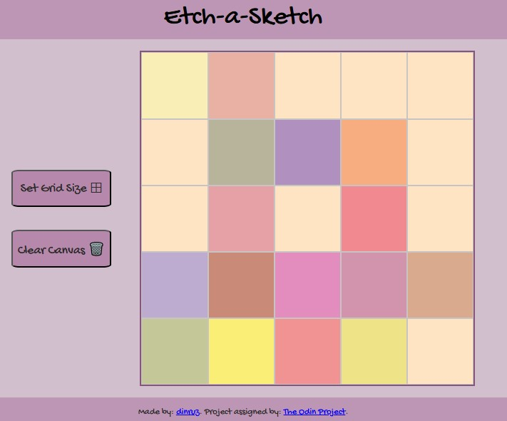
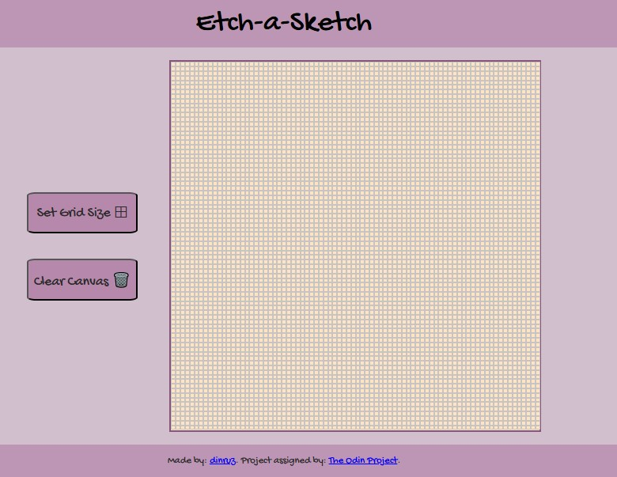
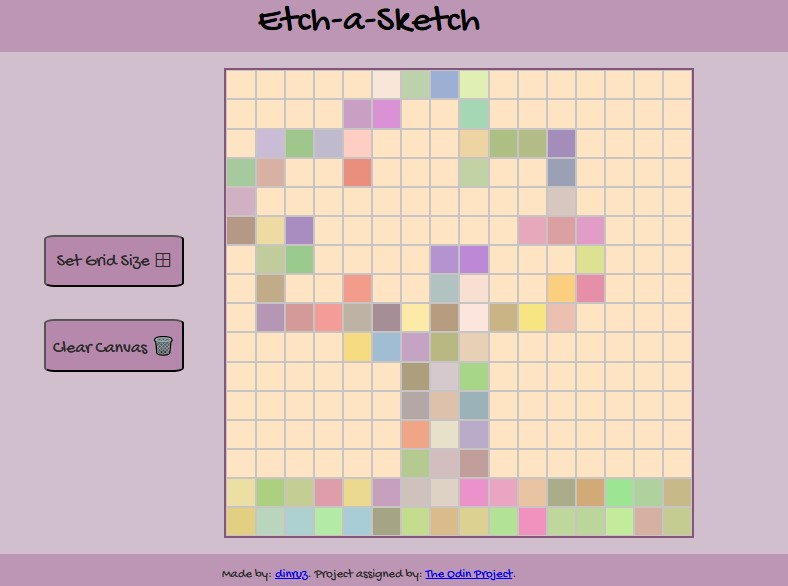
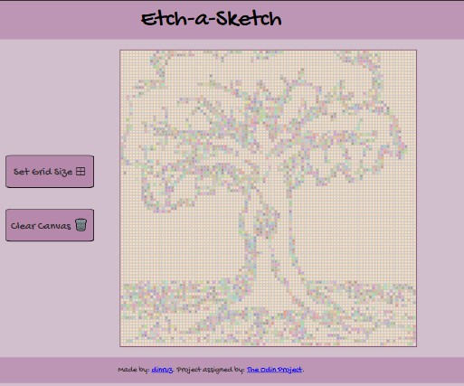

# The Odin Project: Etch-a-Sketch 

## Table of contents

- [Overview](#overview)
- [Links](#links)
- [Screenshots](#screenshots)
- [Technical Details](#technical-details)
  - [Built with](#built-with)
  - [How to Play](#how-to-play)
- [Credits](#credits)

## Overview

This repository contains the solution for "Etch-a-Sketch" project from The Odin Project.

Etch-a-Sketch project is a browser version of game between a sketchpad and an Etch-A-Sketch toy.
This project was assigned by The Odin Project Curriculum (Foundations Course), for practising DOM Manipulation and event listener skills. 

📅 Oct 2025

📌 *Note: The application is optimized only for desktop use.*

## Links 

* Solution URL: [GitHub Repo](https://github.com/dinruz/frontend-projects/the-odin-project/04-etch-a-sketch)

* Live Site URL: [Etch-a-Sketch](https://dinruz.github.io/frontend-projects/the-odin-project/04-etch-a-sketch)

## Screenshots

<table style="width: 100%; border-collapse: collapse;">
  <tr>
    <th colspan="2" style="text-align: center; padding: 20px 10px 10px 10px;">
      <h3>Grid Settings</h3>
    </th>
  </tr>
  <tr>
    <td style="text-align: center; width: 50%; vertical-align: top">
      <h4>Custom Small Grid</h4>
      
      
Manual setup for a 5x5 grid layout.

    </td>
    <td style="text-align: center; width: 50%; vertical-align: top">
      <h4>Custom Large Grid</h4>
      
      
Manual setup for an 80x80 grid layout.

    </td>
  </tr>

  <tr>
    <th colspan="2" style="text-align: center; padding: 20px 10px 10px 10px;">
      <h3>Drawing & Canvas Limits</h3>
    </th>
  </tr>
  <tr>
    <td style="text-align: center; width: 50%; vertical-align: top">
      <h4>Active Drawing</h4>
      
      
Example of drawing with random colors and opacity on 16x16.

    </td>
    <td style="text-align: center; width: 50%; vertical-align: top">
      <h4>Maximum Capacity</h4>
      
      
Performance test on a 100x100 grid canvas.

    </td>
  </tr>
</table>
    

## Technical Details 

### Built with 

🧩 **Key Feature**  

The application implements a unique drawing feature:

* **Random Color Generation:** On each cell hover, a random RGB color is generated.
* **Opacity Effect:** The generated color is applied with a fixed opacity of 40%.

### How to Play

* **Drawing**  🖌️

    - simply move your cursor over the canvas 
    - each square your cursor passes over will change color

 * **Clearing the Canvas** 

    - click the *"Clear Canvas* 🗑️" button
   - all squares are reset giving you a fresh canvas.

 * **Change Grid Size** 

    - click the "*Set Grid Size* ⊞ " button
    - enter a new numerical value (e.g.*50* for 50x50) to define the dimensions (maximum is 100)
    - new grid is rendered with the specified size

##  Credits

🔗 Instructions: [**The Odin Project**](https://www.theodinproject.com/lessons/foundations-etch-a-sketch) 

